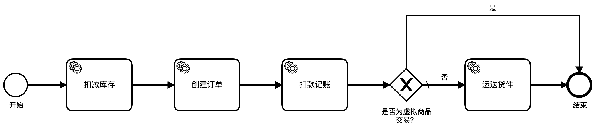
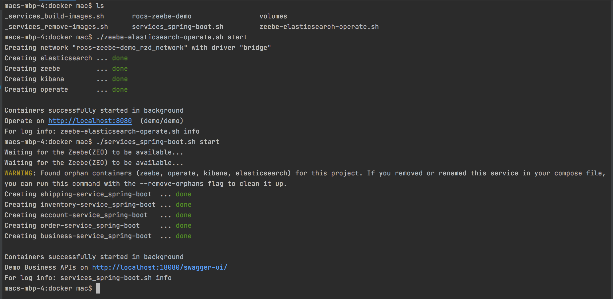
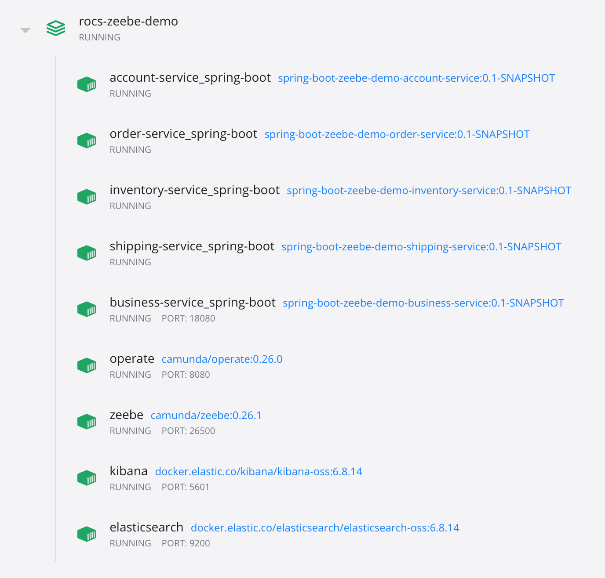
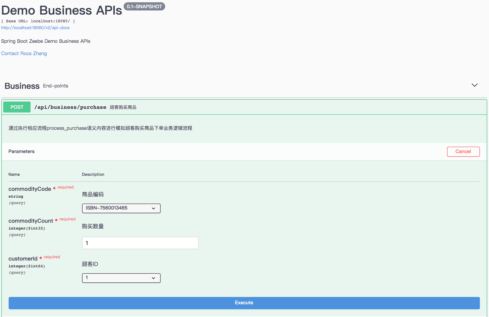
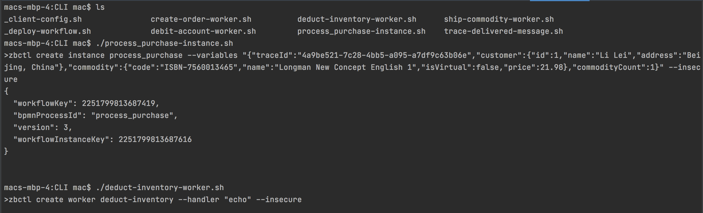
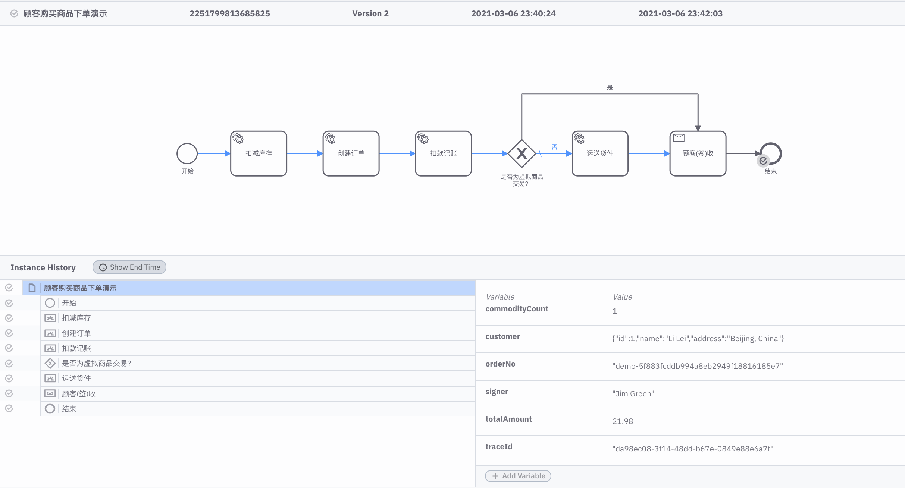
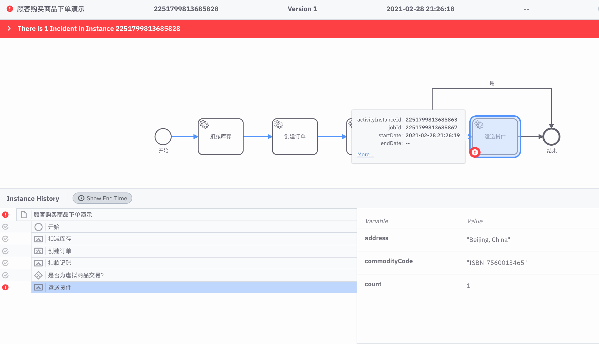
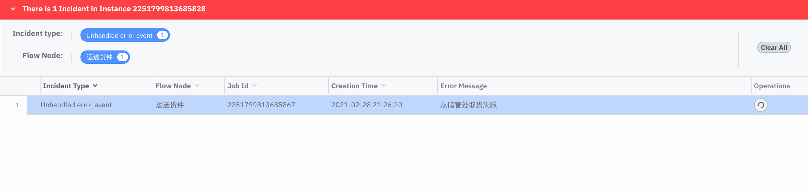

# rocs-zeebe-demo  Zeebe 入门实战

## 项目背景介绍

启动该项目希望可以帮助更多社区Zeebe初学者能够快速入门，并以模拟电商在线交易系统中顾客购买商品的下单业务流程作为Zeebe企业级实战的项目原型。

本项目将通过尽可能通俗并接近企业实际业务场景以及业务流程的案例进行演示：

- 如何结合Zeebe来对端到端的业务流程编排完成从设计到建模，模拟与执行，监控，分析以及优化等各个环节。

- 如何集成Zeebe并使用Java、Spring Boot、JavaScript/TypeScript、Node.js、.NET、Go等等各种语言与各式框架来编写管理与适配程序进行流程控制和业务绑定。

## 软件技术方法栈

- 领域驱动设计（DDD）
- 图形化建模语言工具： BPMN  2.0，Zeebe Modeler v0.11.0
- 分布式工作流引擎与编排框架：Zeebe 0.26.1
- 事件驱动架构（EDA）
- 编制型 Saga 模式
- 安全授权机制与标准：OAuth 2.0
- 基于 HTTP/2 和 Proto3 的 RPC 通讯框架：gRPC
- (文档型)数据分析引擎：Elasticsearch 6.8.14
- 可视化流程监控与分析系统：Operate 0.26.0，Kibana 6.8.14
- 容器管理工具：Docker Compose， Docker Desktop
- 容器引擎：Docker
- 各个模块开发语言与框架：

| 模块                              | 语言框架版本                                                 | Zeebe 客户端                       |
| --------------------------------- | ------------------------------------------------------------ | ---------------------------------- |
| services/CLI                      | Bash command shell                                           | Zeebe CLI client 0.26.0            |
| services/spring-boot              | Java 11 & OpenJDK 11，Spring Boot 2.4.3，Maven 3.6；Swagger 2.0，SpringFox 3.0.0 | Zeebe Java Client 0.26.0           |
| services/spring-boot-with-starter | Java 11 & OpenJDK 11，Spring Boot 2.4.3，Maven 3.6；Swagger 2.0，SpringFox 3.0.0 | Spring Zeebe Client Starter 0.26.2 |
|                                   |                                                              |                                    |

## 附演示效果图

